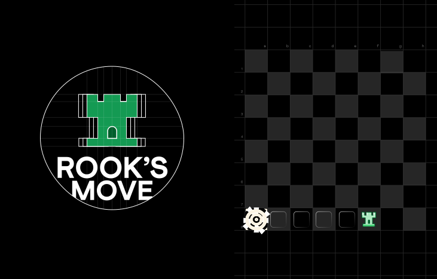

## Rook's Move Frontend

<p align="center">
  
</p>

## Introduction

Welcome to the Rook Move Game, an exhilarating 1v1 chess-inspired challenge where strategic thinking and quick decision-making are the keys to victory! In this fast-paced game, players navigate an 8x8 chessboard, guiding their rook pieces to race to the bottom-left corner before their opponent does. Let the battle of wits begin!

## Tech Stack

- **React**: Initially started with DOM manipulation, but switched to React due to the complexity of the project.
- **Bootstrap**: Design library for a sleek and responsive interface.
- **spinners-react**: Beautiful spinners to enhance the user experience.
- **Redux**: Used for state management to efficiently handle game state and user interactions.
- **Socket.io**: Employed for real-time communication between players, creating a seamless and interactive gaming experience.
- **Phaser 3**: Desktop and Mobile HTML5 Game Framework, enhancing the gaming environment.

## Installation

### 1. Clone the Repository

```bash
git clone https://github.com/om-prakash-yadav/rook-move-frontend.git
```

### 2. Install Dependencies

```bash
npm install
```

### 3. Start the Server

```bash
npm start
```

Feel free to explore the codebase and customize the game as per your preferences!

---
